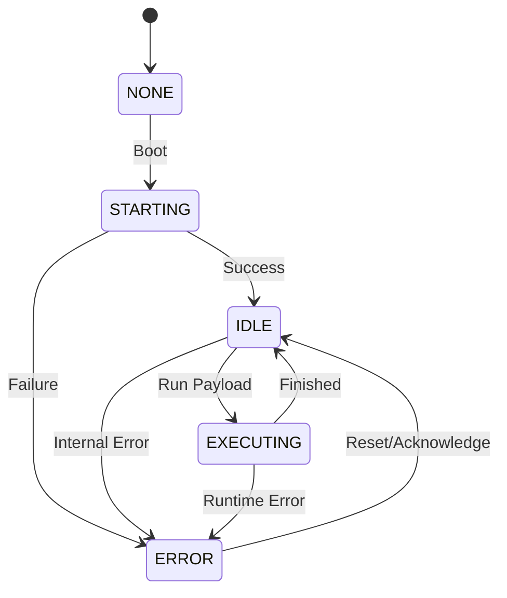

# Onnyx

[](https://github.com/Levy-Y/onnyx/actions/workflows/rust_ci.yml)
[](https://www.gnu.org/licenses/agpl-3.0)
[](https://lilygo.cc/en-us/products/t-dongle-s3)


**Onnyx** is a reimagined USB Rubber Ducky firmware written in Rust, specifically optimized for the **ESP32-S3** (Lilygo T-Dongle-S3). It transforms your dongle into a powerful, wireless-controlled HID injection tool with a modern web-based management interface.

---

## 🚀 Features

-   **Wireless Payload Management**: Execute payloads via a built-in Web Interface.
-   **HID Injection**: Emulates a USB Keyboard for seamless payload delivery.
-   **SD Card Integration**: Persistent storage for complex payloads.
-   **Visual Feedback**: Real-time device state monitoring via the onboard LCD display.
-   **Wi-Fi AP Mode**: Automatic Access Point creation for easy connection without external networks.

## 🛠️ Hardware Requirements

-   **Core Device**: [Lilygo T-Dongle-S3](https://lilygo.cc/en-us/products/t-dongle-s3)
-   **Storage**: MicroSD Card formatted as *FAT32*
---

## 📦 Getting Started

### ❄️ Development Environment (Recommended)

This project provides a **Nix Flake** to automatically set up the entire development environment, including the specialized Rust Xtensa toolchain, `espflash`, `just`, and all necessary PATHs.

If you have [Nix](https://nixos.org/) installed with flakes enabled:

```bash
# Enter the development shell
nix develop

# Or use direnv to load it automatically
direnv allow
```

### 🛠️ Manual Setup (Alternative)

If you are not using Nix, you will need to install the prerequisites manually:

1.  **Rust ESP Toolchain**: Install and run `espup`.
    ```bash
    cargo install espup
    espup install
    # Follow the instructions to source the export file
    ```
2.  **ESPFlash & Just**:
    ```bash
    cargo install espflash just
    ```

### Building & Flashing

Clone the repository and run the following commands using `just`:

```bash
# Builds the firmware, and flashes your device
just flash  # add -m to monitor
```

---

## 🎮 Usage

1.  **Power On**: Plug the T-Dongle-S3 into a USB port.
2.  **Connect**: The device will create a Wi-Fi Access Point (default credentials displayed on the screen).
3.  **Access Web UI**: Navigate to `http://onnyx.local` in your browser.
4.  **Execute**: Select the desired payload from the list and hit `run`.

---

## 🏗️ Internal Architecture

Onnyx is built using the **Actor-based architecture** and a **State Machine** to manage concurrent tasks on the ESP32-S3.


-   **`StateMachine`**: The central hub that manages device states, and notifies subscribers like the Display Manager.
-   **`ExecutorActor`**: Handles the USB HID injection and payload processing.
-   **`WebActor`**: Lightweight web server that serves the management interface and handles API requests.
-   **`StorageManager`**: Manages SD Card interactions using FATFS.
-   **`DisplayManager`**: Provides the visual interface using `embedded-graphics` and the `ST7735` driver.

### State Machine Flow



---

## 📜 License

This project is licensed under the **GNU AGPLv3**. See the [LICENSE](LICENSE) file for details.

---

## 🤝 Contributing

Contributions are welcome! Please feel free to submit a Pull Request or open an issue for bugs and feature requests.

*Disclaimer: This tool is for educational and authorized security testing purposes only. Use responsibly.*
